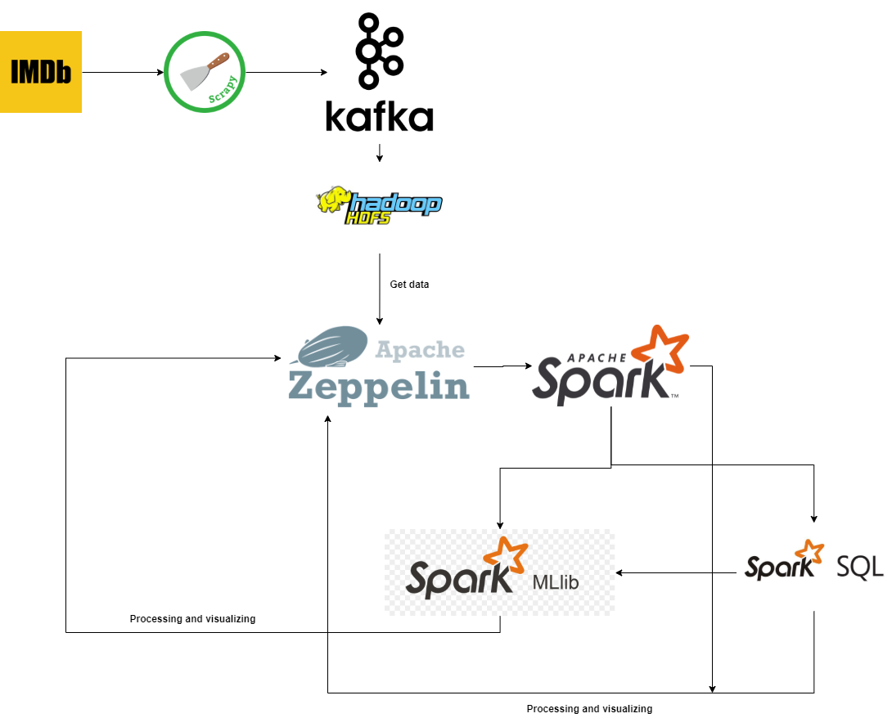

# Project-Bigdata
- This is my Project in Bigdata Course - IT4931 (Hanoi University Science and Technology)
- Main content: Crawl data, Processing and EDA data, build Movie recommendation system on bigdata and distributed system
- Use: Scrapy, Hadoop, HDFS, Spark, Spark SQL, Spark ML, Zeppelin
## How to run crawler
`scrapy crawl movie -o movies.csv -t csv`
## Setup and run 
- refe report in docs to setup and run 
## Flowchart

## Good luck!!!
